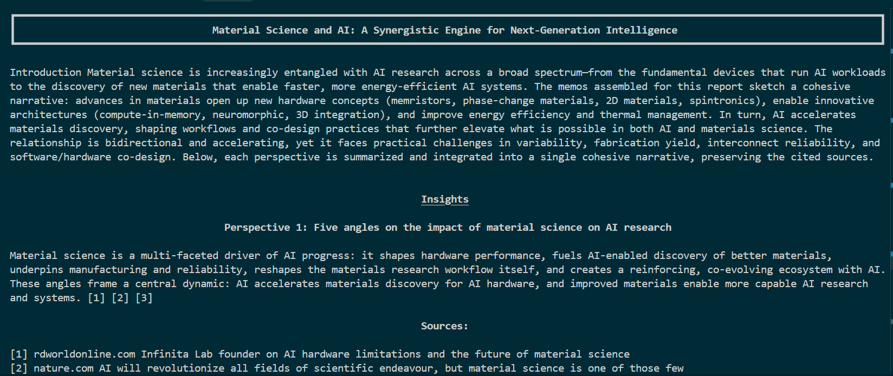

# 📚 Research Agent Movius  

An intelligent **research assistant** that generates structured reports from user queries.  
It can:  
- Validate whether a query is a legitimate research question.  
- Explore multiple perspectives (angles).  
- Search the web + Wikipedia for sources(Uses parallel tool calling).  
- Generate a structured markdown report.  
- Revise reports based on user feedback.  

---

## 🚀 Setup Instructions  

### 1. Clone the repo & install dependencies
```bash
git clone <your-repo-url>
cd Research-Agent-Movius
pip install -r requirements.txt
```

### 2. Environment variables  
Create a `.env` file in the root directory with:
```env
OPENAI_API_KEY=your_openai_key
LANGSMITH_API_KEY=your_langsmith_key
TAVILY_API_KEY=your_tavily_key 
```

### 3. Run the agent  
```bash
python main.py
```

---

## 🏗️ Architecture & Reasoning Flow  

The agent is built using **LangGraph**.  

### 🔹 High-level flow
1. **User query** → classify:  
   - *New research?* → validation → generate angles.  
   - *Revise existing report?* → revision node.  
2. **Angle exploration** → Look at the different perspectives that can be explored about the topic.
3. **Search web and wikipedia** → subgraph searches for relevant documents using tools. Based on number of angles/perspectives parallel calls are made (Wikipedia + Web).
4. **Answer generation** → context gathered per angle.
6. **Report writing** → structured markdown report.  
7. **Optional revisions** → user provides feedback → report updated.  

### 🔹 Graph overview  

```
User Query
   │
   ▼
 [decide] ────────────────► [revise] ──► END
   │
   ▼
 [validator] → (invalid?) → END
   │
   ▼
 [create_angles]
   │
   ▼
[search_one_angle] (Wikipedia + Web) (Triggered by Send in parallel to save time)
   │
   ▼
 [report] ────────────────────────────► END
```

### 🔹 Components
- **Agent.py** → main orchestration graph.  
- **search_tool.py** → sub-agent for retrieving and summarizing sources.  
- **main.py** → interactive CLI for queries.  

---

## 💡 Sample Interactions  

### Start Query


### Generated Response


- The report is generated in Markdown format with introduction and citations for each section.

### Revision Example


- The Agent has made the requested changes and output the revised report.
---

## 📂 Project Structure  

```
.
├── Agent.py          # Core research workflow
├── search_tool.py    # Web + Wikipedia search subgraph
├── main.py           # CLI interface
├── requirements.txt  # Dependencies
└── .env              # API keys (not committed)
```

## Further Potential Improvements

- Break modules like report creator into multiple nodes to create introduction, body, citations and conclusion. These specialized nodes will perform better and provide high quality output.
- Utilize better models
- Optimize revise flow to utilize tools and look deeperinto past conversations.
- Use an agent to plan steps for report creation vs revision and delegate tasks. This way smaller reports will take lesser time.
- Introduce fact checking of the sections written.
- Human in the loop to tweak perpectives before report generation.
- Dynamic formatting as per ask (word, markdown, html etc.)
- Reduce latency by using lowlatency models for simple tasks.
